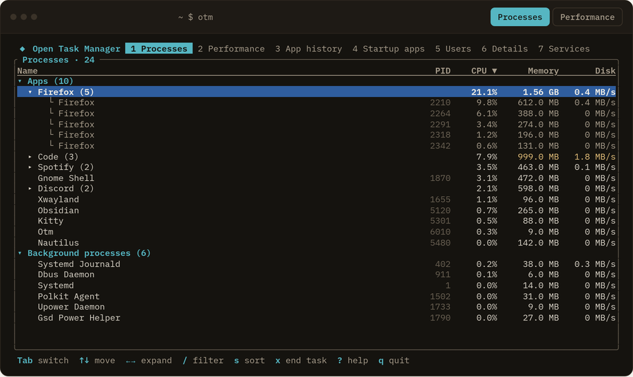

<p align="center">
  
</p>

<h1 align="center">Open Task Manager</h1>

<p align="center">
  A fast, open-source process &amp; performance monitor: the Windows&nbsp;11 Task Manager layout,
  rebuilt with <a href="https://tauri.app">Tauri</a> and Rust instead of Electron, for Linux, Windows
  and macOS. Comes as a desktop app <em>and</em> <code>otm</code>, a terminal UI.
</p>

<p align="center">
  <a href="https://github.com/sabaoongfx/Open-Task-Manager/releases">
    
  </a>
</p>

<p align="center">
  <a href="https://opentaskmanager.vercel.app"><strong>Website &amp; live demo</strong></a> ·
  <a href="#install">Install</a> ·
  <a href="#terminal-ui-otm">Terminal UI</a> ·
  <a href="#development">Development</a>
</p>

---

<p align="center">
  
  <br />
  
  <br />
  
</p>

## What it is

Open Task Manager shows what your computer is doing right now: which processes are
running, how much CPU, memory and disk each one uses, and a live rolling history of
system-wide CPU, memory, disk and network activity.

It comes in two forms that share one Rust backend, which reads process and hardware data
straight from the OS through the [`sysinfo`](https://crates.io/crates/sysinfo) crate:

- **The desktop app**: a native window using the system webview (no bundled Chromium).
- **`otm`**: the same seven tabs in a terminal UI, for SSH sessions, servers, or anyone who
  lives in a terminal.

No telemetry, no background service.

## Install

On Linux, every package installs **both** apps: the desktop app (**Open Task Manager** in
your app menu, or `open-task-manager`) and the terminal UI (`otm`).

### Ubuntu, Debian, Linux Mint, Pop!_OS (apt)

Ubuntu 22.04+ or Debian 12+, x86_64. Add the signed repository once:

```bash
curl -fsSL https://sabaoongfx.github.io/Open-Task-Manager/KEY.gpg \
  | sudo gpg --dearmor -o /usr/share/keyrings/open-task-manager.gpg
echo "deb [signed-by=/usr/share/keyrings/open-task-manager.gpg] https://sabaoongfx.github.io/Open-Task-Manager stable main" \
  | sudo tee /etc/apt/sources.list.d/open-task-manager.list
sudo apt update && sudo apt install open-task-manager
```

Updates then arrive with the normal `sudo apt upgrade`.

### Arch Linux, Manjaro, EndeavourOS (pacman)

A signed repository, built natively on Arch:

```bash
curl -fsSL https://sabaoongfx.github.io/Open-Task-Manager/KEY.gpg | sudo pacman-key --add -
sudo pacman-key --lsign-key "Open Task Manager packages"
printf '\n[open-task-manager]\nServer = https://sabaoongfx.github.io/Open-Task-Manager/arch/$arch\n' \
  | sudo tee -a /etc/pacman.conf
sudo pacman -Sy open-task-manager
```

Updates then arrive with the normal `sudo pacman -Syu`. To build it yourself instead (no
automatic updates): clone this repo, `cd packaging/aur/open-task-manager`, `makepkg -si`.
AUR packages are prepared and will be published once AUR account registration reopens.

### Fedora, openSUSE and other distributions

From the [latest release](https://github.com/sabaoongfx/Open-Task-Manager/releases/latest):

- `.rpm` for Fedora and openSUSE: `sudo dnf install ./open-task-manager-*.rpm`
- `.AppImage` for anything else (desktop app only). This link always points to the newest
  version:
  [Open-Task-Manager-x86_64.AppImage](https://github.com/sabaoongfx/Open-Task-Manager/releases/latest/download/Open-Task-Manager-x86_64.AppImage)

  ```bash
  chmod +x Open-Task-Manager-x86_64.AppImage
  ./Open-Task-Manager-x86_64.AppImage
  ```

### Windows

Download the `.msi` or `-setup.exe` installer from the
[latest release](https://github.com/sabaoongfx/Open-Task-Manager/releases/latest). It isn't
code-signed yet, so SmartScreen may warn you: choose *More info → Run anyway*.

### macOS

Download the `.dmg` from the
[latest release](https://github.com/sabaoongfx/Open-Task-Manager/releases/latest): `aarch64`
for Apple Silicon (M1 and newer), `x64` for Intel. It isn't notarized yet, so the first time
you open it, right-click the app and choose *Open*.

### Just `otm` (terminal only)

For servers and minimal installs, with no desktop app and no webview: download the `otm`
archive for Linux, macOS or Windows from the
[latest release](https://github.com/sabaoongfx/Open-Task-Manager/releases/latest), or build
it with Rust:

```bash
cargo install --locked --git https://github.com/sabaoongfx/Open-Task-Manager otm
```

## Features

### Processes

- **Grouped by name**: multiple instances of the same app (e.g. `Google Chrome (5)`)
  collapse into a single row with combined CPU/memory/disk totals; click the row or its
  chevron to expand and see each instance.
- **Apps vs. Background processes**: the same categorization Windows Task Manager uses,
  based on well-known service/daemon name patterns.
- **Search, sort, and select**: filter the list by name, sort any column
  (Name/PID/CPU/Memory/Disk), click a row to select it.
- **Right-click to end a task**: a context menu on every row and expanded sub-row.
- **Efficiency mode**: a compact row-height toggle for scanning long lists.
- **Heat-mapped CPU/Disk cells**: busier processes get a subtly stronger highlight,
  scaled relative to the busiest process currently visible.

### Performance

- Four tiles (**CPU, Memory, Disk, Network**), each with a live sparkline.
- A larger detail chart per metric with a 60-second rolling history, sampled every 1.5s.
- Real hardware info: CPU brand/frequency/core counts, per-disk capacity and type,
  network interface throughput.

### Details & Users

- **Details**: a flat, sortable process list with each process's real status and
  owning user, resolved via `sysinfo`. Right-click to end a task.
- **Users**: processes grouped by owning account, with live CPU/memory/disk totals
  per user; expand a user to see their individual processes.

### Startup apps & Services

- **Startup apps**: real autostart entries parsed from `/etc/xdg/autostart` and
  `~/.config/autostart`, with Enable/Disable (updates the app's own view only, not
  your real autostart config).
- **Services**: the real systemd service list (name, description, status), with
  Start/Stop (also UI-only for now; see [Roadmap](#roadmap)).

### App history

Real cumulative CPU time per app, tracked since the app was launched (not persisted
across restarts), with a working "Delete usage history" action.

### Terminal UI (`otm`)

The same seven tabs in the terminal, backed by the exact same data collection as the
desktop app: grouped processes you can expand, filtering, sorting, end task with a
confirmation prompt, Braille graphs for CPU/memory/disk/network, and mouse support
(click tabs, column headers and rows; scroll). Press `?` inside it for every key binding;
the essentials:

| Key                    | Action                              |
| ---------------------- | ----------------------------------- |
| `Tab` / `1`–`7`        | switch tab                          |
| `↑↓` / `j k`           | move selection                      |
| `→ ←` / `Enter`        | expand / collapse a group           |
| `/`                    | filter by name                      |
| `s` / `S`              | next sort column / reverse order    |
| `x` / `Delete`         | end task (asks for confirmation)    |
| `r`                    | reset App history / reload Startup apps & Services |
| `q`                    | quit                                |

`otm --interval 1000` changes the refresh rate (milliseconds, default 1500, minimum 250).
On Startup apps and Services it's read-only: there's no enable/disable or start/stop yet.

## Roadmap

- Make Start/Stop (Services) and Enable/Disable (Startup apps) act on the real system
  instead of just the app's own view.
- Persist App history across restarts.
- Signed installers for Windows and macOS.
- Publish to the AUR (packages are ready; waiting for AUR account registration to reopen).
- Linux: stop counting threads as separate processes (it inflates the process count and
  the per-user memory totals).

## Tech stack

| Layer          | Choice                                          |
| -------------- | ------------------------------------------------ |
| UI             | React 19 + TypeScript, plain CSS (no framework)  |
| Build tool     | Vite                                             |
| Desktop shell  | [Tauri 2](https://tauri.app)                     |
| Terminal UI    | [ratatui](https://ratatui.rs) + crossterm        |
| System data    | Rust + [`sysinfo`](https://crates.io/crates/sysinfo) |
| Testing        | [Playwright](https://playwright.dev), `cargo test` |
| Linux packages | Signed apt (`reprepro`) and pacman (`repo-add`) repos on GitHub Pages |

The frontend also runs standalone in a regular browser (`npm run dev`) against a
generated mock snapshot (see `src/mockData.ts`), so you can work on the UI without a
Rust toolchain — the app only calls into the real Tauri backend when it detects it's
actually running inside the native shell.

## Development

### Prerequisites

- [Node.js](https://nodejs.org/) 18+ and npm
- [Rust](https://www.rust-lang.org/tools/install) (stable toolchain): needed for the native
  app and `otm`; the frontend alone only needs Node
- Platform build dependencies for Tauri — see the
  [Tauri prerequisites guide](https://tauri.app/start/prerequisites/) for your OS

### Install dependencies

```bash
npm install
```

### Run in a browser (mock data, no Rust needed)

```bash
npm run dev
```

Opens the Vite dev server at `http://localhost:1420`. Process data is simulated —
useful for iterating on layout and styling quickly.

### Run as the native desktop app (real system data)

```bash
npm run tauri dev
```

Compiles the Rust backend and opens a native window backed by real `sysinfo` data,
with hot-reload on both the frontend and backend.

### Run the terminal UI (`otm`)

```bash
cargo run -p otm            # debug build, real system data
cargo install --path tui    # or put your local build on your PATH as `otm`
```

It needs only a Rust toolchain: no Node, no webview.

### Build a release binary

```bash
npm run tauri build
```

Installers land in `target/release/bundle/`. The Linux `.deb` and `.rpm` also contain `otm`
(`beforeBundleCommand` builds it right before bundling).

### Run the test suites

```bash
npx playwright test        # frontend, in a browser against mock data
cargo test --workspace     # Rust: otm-core, plus otm rendered against live data
```

The Playwright suite (`tests/`) drives the app in a browser against the mock data
backend, covering tab navigation, the process table (grouping, search, sort, the
context menu, efficiency mode), and the performance charts. The Rust tests cover the
backend and render every `otm` tab through ratatui's test backend.

### Releasing

1. Bump the version in `package.json`, the root `Cargo.toml` and `src-tauri/tauri.conf.json`,
   and add a `<release>` entry to `packaging/linux/io.github.sabaoongfx.OpenTaskManager.appdata.xml`.
2. Push a `v*` tag. `release.yml` builds every installer plus the `otm` archives into a
   draft GitHub release, including the AppImage under a versionless name so
   `releases/latest/download/Open-Task-Manager-x86_64.AppImage` always gets the newest one.
3. Publish the draft. `publish-linux.yml` then rebuilds the signed apt and pacman
   repositories on GitHub Pages, so Linux users get the update through their package
   manager.

## Project structure

```
src/                  React frontend
  App.tsx             Main app shell: sidebar, tabs, process table, context menu
  App.css             All styling (design tokens in :root, light/dark aware)
  Performance.tsx      Performance tab: tiles, sparklines, the big chart
  mockData.ts         Deterministic mock snapshot used outside Tauri
  types.ts            Shared TypeScript types for the snapshot/process data
  icons.tsx, appIcons.tsx   UI icons + per-app brand icon matching

core/                 otm-core: all system data collection (sysinfo, systemctl,
                      autostart entries), shared by the desktop app and the TUI

src-tauri/            Tauri shell
  src/lib.rs          Thin #[tauri::command] wrappers around otm-core
  tauri.conf.json     Window size, bundle config

tui/                  otm: the terminal UI (ratatui + crossterm)

tests/                Playwright end-to-end tests

packaging/            Linux packaging: AUR PKGBUILDs, apt repo config,
                      pacman repo script, desktop entry
.github/workflows/    release.yml (installers + otm), publish-linux.yml (apt/pacman repos)

website/              The static site at opentaskmanager.vercel.app, which embeds a real
                      build of the app and real otm renders
docs/                 README screenshots
```

## How it talks to the OS

The frontend polls a single Tauri command, `get_snapshot`, every 1.5 seconds; `otm` calls
the same `otm-core` function (`Monitor::snapshot()`) directly on the same interval. Each
snapshot:

1. Refreshes CPU, memory, process, disk and network state via `sysinfo`.
2. Computes per-process disk I/O rate and system-wide network throughput from the
   delta since the last poll.
3. Serializes it all into one JSON snapshot the frontend renders directly (`otm` uses the
   Rust structs as-is).

Ending a task calls a second command, `kill_process`, with a PID.

On Linux, process names come from `/proc/[pid]/comm`, which is always lowercase and
often hyphenated (e.g. `chromium`, `task-manager`). The backend prettifies these into
title case (`Chromium`, `Task Manager`) — but only when the raw name has no uppercase
letters already, so names that come pre-formatted (`NetworkManager`, `Xorg`) are left
alone.

## License

[MIT](LICENSE)
