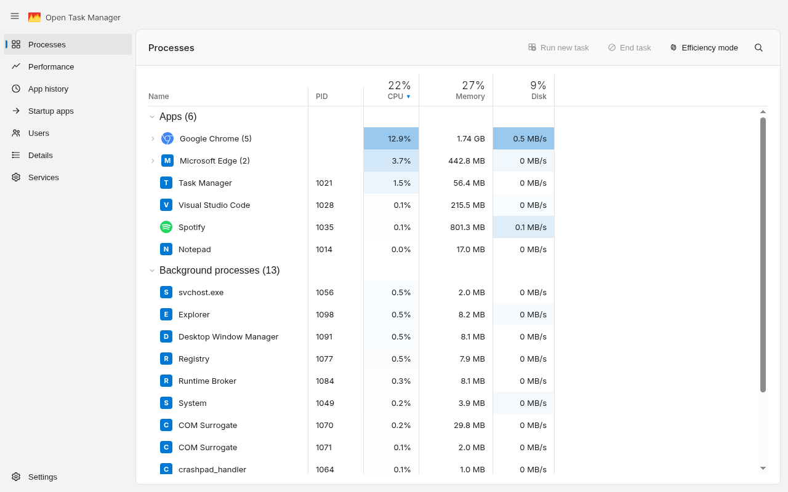
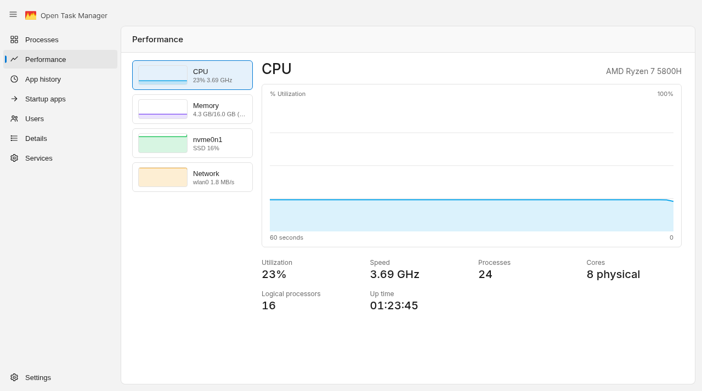

<p align="center">
  
</p>

<h1 align="center">Open Task Manager</h1>

<p align="center">
  A fast, open-source process &amp; performance monitor — the Windows&nbsp;11 Task Manager layout,
  rebuilt with <a href="https://tauri.app">Tauri</a> and Rust instead of Electron.
</p>

<p align="center">
  <a href="https://github.com/sabaoongfx/Open-Task-Manager/releases">
    
  </a>
</p>

---

<p align="center">
  
  <br />
  
</p>

## What it is

Open Task Manager is a cross-platform desktop app for watching what your computer is
doing right now: which processes are running, how much CPU/memory/disk they're using,
and a live rolling history of system-wide CPU, memory, disk and network activity.

It's built as a native window (via Tauri's system webview) with a Rust backend that
reads process and hardware data straight from the OS through the
[`sysinfo`](https://crates.io/crates/sysinfo) crate — no bundled Chromium, no telemetry,
no background service.

## Features

### Processes

- **Grouped by name** — multiple instances of the same app (e.g. `Google Chrome (5)`)
  collapse into a single row with combined CPU/memory/disk totals; click the row or its
  chevron to expand and see each instance.
- **Apps vs. Background processes** — the same categorization Windows Task Manager uses,
  based on well-known service/daemon name patterns.
- **Search, sort, and select** — filter the list by name, sort any column
  (Name/PID/CPU/Memory/Disk), click a row to select it.
- **Right-click to end a task** — a context menu on every row and expanded sub-row.
- **Efficiency mode** — a compact row-height toggle for scanning long lists.
- **Heat-mapped CPU/Disk cells** — busier processes get a subtly stronger highlight,
  scaled relative to the busiest process currently visible.

### Performance

- Four tiles — **CPU, Memory, Disk, Network** — each with a live sparkline.
- A larger detail chart per metric with a 60-second rolling history, sampled every 1.5s.
- Real hardware info: CPU brand/frequency/core counts, per-disk capacity and type,
  network interface throughput.

### Details & Users

- **Details** — a flat, sortable process list with each process's real status and
  owning user, resolved via `sysinfo`. Right-click to end a task.
- **Users** — processes grouped by owning account, with live CPU/memory/disk totals
  per user; expand a user to see their individual processes.

### Startup apps & Services

- **Startup apps** — real autostart entries parsed from `/etc/xdg/autostart` and
  `~/.config/autostart`, with Enable/Disable (updates the app's own view only, not
  your real autostart config).
- **Services** — the real systemd service list (name, description, status), with
  Start/Stop (also UI-only for now — see [Roadmap](#roadmap)).

### App history

Real cumulative CPU time per app, tracked since the app was launched (not persisted
across restarts), with a working "Delete usage history" action.

## Roadmap

- Make Start/Stop (Services) and Enable/Disable (Startup apps) act on the real system
  instead of just the app's own view.
- Persist App history across restarts.
- Signed installers for Windows and macOS.

## Tech stack

| Layer          | Choice                                          |
| -------------- | ------------------------------------------------ |
| UI             | React 19 + TypeScript, plain CSS (no framework)  |
| Build tool     | Vite                                             |
| Desktop shell  | [Tauri 2](https://tauri.app)                     |
| System data    | Rust + [`sysinfo`](https://crates.io/crates/sysinfo) |
| Testing        | [Playwright](https://playwright.dev)             |

The frontend also runs standalone in a regular browser (`npm run dev`) against a
generated mock snapshot (see `src/mockData.ts`), so you can work on the UI without a
Rust toolchain — the app only calls into the real Tauri backend when it detects it's
actually running inside the native shell.

## Getting started

### Prerequisites

- [Node.js](https://nodejs.org/) 18+ and npm
- [Rust](https://www.rust-lang.org/tools/install) (stable toolchain) — only needed to run
  or build the native app; the frontend alone only needs Node
- Platform build dependencies for Tauri — see the
  [Tauri prerequisites guide](https://tauri.app/start/prerequisites/) for your OS

### Install

```bash
npm install
```

### Run in a browser (mock data, no Rust needed)

```bash
npm run dev
```

Opens the Vite dev server at `http://localhost:1420`. Process data is simulated —
useful for iterating on layout and styling quickly.

### Run as the native desktop app (real system data)

```bash
npm run tauri dev
```

Compiles the Rust backend and opens a native window backed by real `sysinfo` data,
with hot-reload on both the frontend and backend.

### Build a release binary

```bash
npm run tauri build
```

### Run the test suite

```bash
npx playwright test
```

The Playwright suite (`tests/`) drives the app in a browser against the mock data
backend, covering tab navigation, the process table (grouping, search, sort, the
context menu, efficiency mode), and the performance charts.

## Project structure

```
src/                  React frontend
  App.tsx             Main app shell: sidebar, tabs, process table, context menu
  App.css             All styling (design tokens in :root, light/dark aware)
  Performance.tsx      Performance tab: tiles, sparklines, the big chart
  mockData.ts         Deterministic mock snapshot used outside Tauri
  types.ts            Shared TypeScript types for the snapshot/process data
  icons.tsx, appIcons.tsx   UI icons + per-app brand icon matching

src-tauri/            Rust backend
  src/lib.rs          Tauri commands: get_snapshot, kill_process
  tauri.conf.json     Window size, bundle config

tests/                Playwright end-to-end tests
```

## How it talks to the OS

The frontend polls a single Tauri command, `get_snapshot`, every 1.5 seconds. On the
Rust side, that command:

1. Refreshes CPU, memory, process, disk and network state via `sysinfo`.
2. Computes per-process disk I/O rate and system-wide network throughput from the
   delta since the last poll.
3. Serializes it all into one JSON snapshot the frontend renders directly.

Ending a task calls a second command, `kill_process`, with a PID.

On Linux, process names come from `/proc/[pid]/comm`, which is always lowercase and
often hyphenated (e.g. `chromium`, `task-manager`). The backend prettifies these into
title case (`Chromium`, `Task Manager`) — but only when the raw name has no uppercase
letters already, so names that come pre-formatted (`NetworkManager`, `Xorg`) are left
alone.

## License

[MIT](LICENSE)
